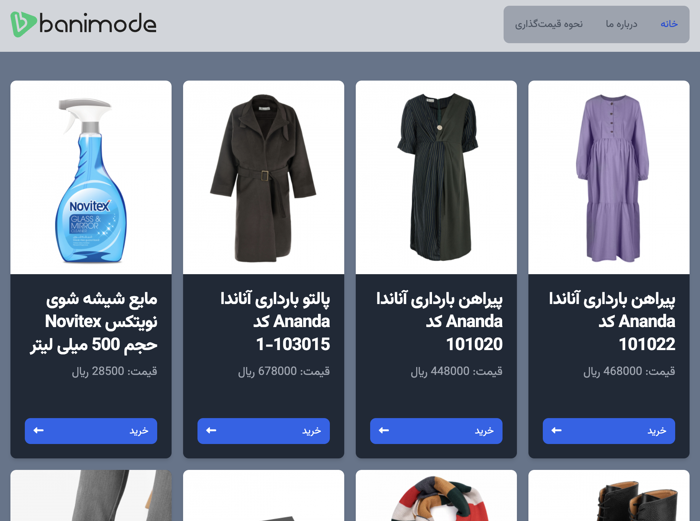

# Ban Ban

## Description

This project is a tool for crawling data from a API and show them to the user in responsive simple website.

## Installation

All services are dockerized and runnig the back-and and front-end services is as simple as running `docker-compose up --build` with this yaml file.

```yaml
version: "3"
services:
  db:
    container_name: db
    image: mongo
    volumes:
      - ./data:/data/db
    ports:
      - "27017:27017"
  ban-bin:
    container_name: ban-bin
    image: latest/ban-bin
    restart: always
    build: ./ban-bin
    ports:
      - "7500:7500"
    depends_on:
      - db
  ban-ban:
    container_name: ban-ban
    image: latest/ban-ban
    restart: always
    build: ./ban-ban
    ports:
      - "5173:5173"
    depends_on:
      - ban-bin
```

To crawl new data and insert them to the data base run the following command on ban-bon folder:

```shell
python ban-crawl.py
```

## Screenshots



Front-end of the website is responsive React+Tailwind app. I use React-Query for remote state management.
